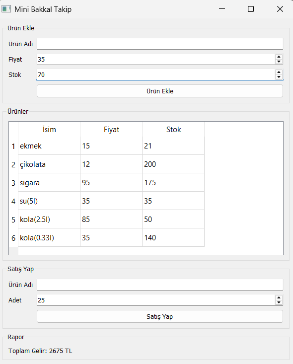

# 🛒 Mini Bakkal Takip

A simple desktop application for managing a small grocery store's inventory and sales, built with Python, PyQt5, and MongoDB.

---

## 📸 Screenshots

> 

---

## ✨ Features

- ➕ **Add Products** — Add new products with name, price, and stock quantity
- 🔄 **Auto Stock Update** — Adding an existing product automatically increases its stock
- 📋 **Product Table** — View all products with live updates from the database
- 💰 **Sales Management** — Sell products by name and quantity with stock validation
- 📊 **Revenue Tracking** — Track total revenue earned during the session

---

## 🛠️ Technologies Used

| Technology | Purpose |
|------------|---------|
| Python 3 | Core programming language |
| PyQt5 | Desktop GUI framework |
| MongoDB | NoSQL database for product storage |
| PyMongo | Python driver for MongoDB |

---

## ⚙️ Installation & Setup

### Prerequisites

- Python 3.x
- MongoDB 7.0 (running on `localhost:27017`)

### 1. Clone the repository

```bash
git clone https://github.com/your-username/mini-bakkal-takip.git
cd mini-bakkal-takip
```

### 2. Install dependencies

```bash
pip install PyQt5 pymongo
```

### 3. Start MongoDB

Make sure MongoDB service is running before launching the app:

```bash
# Windows (run as Administrator)
net start MongoDB
```

### 4. Run the application

```bash
python main.py
```

---

## 📁 Project Structure

```
mini-bakkal-takip/
│
├── main.py          # Main application logic & MongoDB operations
├── bakkal_ui.py     # UI layout built with PyQt5
└── README.md
```

---

## 🚀 Future Improvements

- [ ] Product deletion from the UI
- [ ] Price update for existing products
- [ ] Decimal price support (e.g. 12.50 ₺)
- [ ] Search/filter products in the table
- [ ] Export sales report as PDF or Excel
- [ ] Login screen for multi-user support

---

## 👨‍💻 Author

**Enes B.** — *Software engineer student*

> Built as a personal learning project to practice Python desktop development with database integration.
